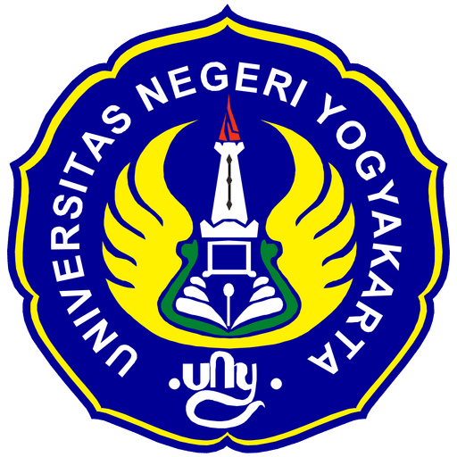

# SPKL DPTEI - Sistem Pengukuran Kelayakan Laboratorium

<div align="center">
  
  
  **Sistem Pengukuran Kelayakan Laboratorium Berdasarkan ISO/IEC 17025:2017**  
  **Departemen Pendidikan Teknik Elektronika dan Informatika - UNY**
</div>

## 📋 Deskripsi Proyek

SPKL DPTEI adalah aplikasi web berbasis Next.js yang dirancang untuk mengukur dan mengevaluasi kelayakan laboratorium berdasarkan standar ISO/IEC 17025:2017. Sistem ini membantu Departemen Pendidikan Teknik Elektronika dan Informatika UNY dalam mengelola compliance dan kualitas laboratorium secara digital dan terintegrasi.

## ✨ Fitur Utama

### 🔐 **Manajemen Pengguna**

- Sistem autentikasi (login/register) dengan JWT
- Manajemen sesi pengguna yang aman
- Role-based access control

### 🏭 **Manajemen Laboratorium**

- Pendaftaran dan pengelolaan data laboratorium
- Monitoring persentase compliance
- Tracking tanggal inspeksi terakhir
- Dashboard visual untuk status laboratorium

### 📝 **Sistem Asesmen**

- Periode asesmen yang dapat dikonfigurasi
- Formulir asesmen berbasis standar ISO/IEC 17025:2017
- Penyimpanan jawaban dalam format JSON
- Upload dokumen pendukung untuk setiap asesmen
- Sistem penilaian otomatis

### 📊 **Dashboard & Laporan**

- Statistik real-time laboratorium
- Grafik compliance berdasarkan kategori
- Bar chart perbandingan antar laboratorium
- Status compliance dengan indikator visual

### 📄 **Manajemen Dokumen**

- Upload dan kategorisasi dokumen
- Penyimpanan file menggunakan Vercel Blob
- Metadata dokumen lengkap (ukuran, tipe, tanggal upload)
- Sistem pencarian dan filter dokumen

### 📈 **Visualisasi Data**

- Chart compliance kategori menggunakan Recharts
- Dashboard interaktif dengan filter
- Export laporan (dalam pengembangan)

## 🛠️ Teknologi yang Digunakan

### Frontend & Framework

- **Next.js 15.3.3** - React framework dengan App Router
- **React 19** - Library UI utama
- **TypeScript 5** - Type-safe JavaScript
- **Tailwind CSS 4** - Utility-first CSS framework

### UI Components & Styling

- **Radix UI** - Headless UI components
- **Lucide React** - Icon library
- **React Icons** - Additional icons
- **Class Variance Authority** - Utility untuk variant styling
- **Tailwind Merge & clsx** - Class name utilities

### Backend & Database

- **Neon Database** - PostgreSQL serverless database
- **Vercel Blob** - File storage solution
- **JWT (jsonwebtoken)** - Authentication tokens
- **bcryptjs** - Password hashing

### Data Visualization

- **Recharts** - Charts dan grafik
- **React Day Picker** - Date picker component
- **date-fns** - Date manipulation utilities

## 🏗️ Struktur Proyek

```
spkl-dptei/
├── app/                          # Next.js App Router
│   ├── api/                      # API Routes
│   │   ├── auth/                 # Authentication endpoints
│   │   ├── assessment-files/     # File management API
│   │   └── upload-document/      # Document upload API
│   ├── auth/                     # Authentication pages
│   │   ├── login/               # Login page
│   │   └── register/            # Register page
│   ├── dashboard/               # Main dashboard
│   │   ├── asesmen/            # Assessment module
│   │   ├── dokumen/            # Document management
│   │   ├── laboratorium/       # Laboratory management
│   │   └── components/         # Dashboard components
│   ├── globals.css             # Global styles
│   ├── layout.tsx              # Root layout
│   └── page.tsx                # Homepage
├── components/                  # Reusable components
│   ├── ui/                     # UI component library
│   ├── loginForm.tsx           # Login form component
│   ├── registerForm.tsx        # Register form component
│   └── datePicker.tsx          # Date picker component
├── contexts/                   # React contexts
│   ├── auth-context.tsx        # Authentication context
│   └── sidebar-context.tsx     # Sidebar state context
├── db/                        # Database related files
│   ├── db.ts                  # Database configuration
│   └── migration.sql          # Database schema migration
├── lib/                       # Utility libraries
│   ├── auth.ts               # Authentication utilities
│   ├── blob-config.ts        # File storage configuration
│   └── utils.ts              # General utilities
└── public/                   # Static assets
    └── logo-uny.png          # UNY logo
```

## 📊 Database Schema

Sistem menggunakan PostgreSQL dengan schema sebagai berikut:

- **User** - Data pengguna dan autentikasi
- **Laboratory** - Informasi laboratorium dan status compliance
- **Assessment** - Master pertanyaan asesmen
- **AssessmentPeriod** - Periode asesmen yang dapat dikonfigurasi
- **AssessmentAnswer** - Jawaban asesmen dengan dukungan file
- **Document** - Manajemen dokumen dengan metadata lengkap

## 🎯 Penggunaan

### 1. **Registrasi & Login**

- Akses `/auth/register` untuk membuat akun baru
- Login melalui `/auth/login` dengan kredensial yang telah dibuat

### 2. **Manajemen Laboratorium**

- Tambah laboratorium baru di menu "Laboratorium"
- Monitor status compliance dan tanggal inspeksi
- Update data laboratorium sesuai kebutuhan

### 3. **Pelaksanaan Asesmen**

- Buat periode asesmen baru di menu "Asesmen"
- Isi formulir asesmen berdasarkan standar ISO/IEC 17025:2017
- Upload dokumen pendukung untuk setiap jawaban
- Review dan submit asesmen

### 4. **Monitoring Dashboard**

- Pantau statistik compliance secara real-time
- Analisis grafik performa per kategori
- Bandingkan performa antar laboratorium

## 📄 Lisensi

Proyek ini dikembangkan untuk kepentingan pendidikan dan penelitian di lingkungan Universitas Negeri Yogyakarta.

<div align="center">
  <strong>SPKL DPTEI - ISO/IEC 17025:2017 Laboratory Compliance System</strong><br>
  <em>Mendukung Standar Laboratorium Berkualitas Internasional</em>
</div>
